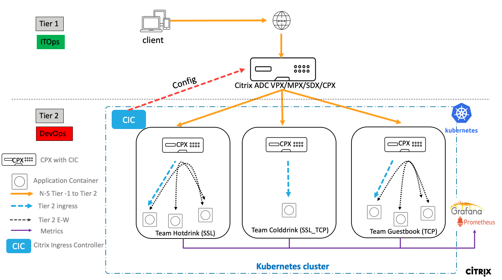
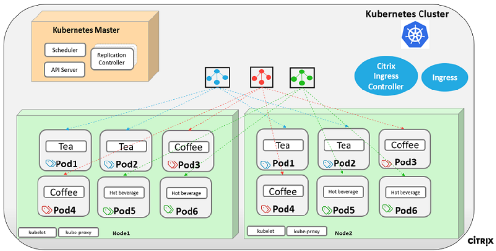

## Learn how to use Citrix ADC in two tier microservices architecture

Citrix ADC offers the two-tier architecture deployment solution to load balance the enterprise grade applications deployed in microservices and access through internet. Tier 1 has heavy load balancers such as VPX/SDX/MPX to load balance north-south traffic and tier 2 has CPX deployment for managing microservices and load balances the east-west traffic.



In the Kubernetes cluster, pod gets deployed across worker nodes. Below screenshot demonstrates the microservice deployment which contains 3 services marked in blue, red and green colour and 12 pods running across two worker nodes. These deployments are logically categorized by Kubenetes namespace (e.g. team-hotdrink namespace)


Here are the detailed demo steps in cloud native infrastructure which offers the tier 1 and tier 2 seamless integration along with automation of proxy configuration using yaml files.


## Steps to do before starting deploying demo
### Requirements
Finish Requirements and [Prerequisites](../prerequisites)


### Kubernetes

Make yourself comfortable with Kubernetes concepts and Kubernetes CLI.

  #### Concepts
  You can find multiple introductions into Kubernetes concepts on the internet.

   But a good starting point is the [Kubernetes Project Introduction](https://kubernetes.io/docs/concepts/).

   Another really easy (and quite cute) explanation you can find in [this video (The Illustrated Children's Guide to Kubernetes)](https://www.youtube.com/watch?v=4ht22ReBjno)

  #### Kubernetes Cli

  If you finished the [Prerequisites](../prerequisites) your MicroK8s CLI has an alias for `microk8s.kubectl` called `kubectl` and it feels like using a vanilla Kubernetes CLI.

 * check your nodes: `kubectl get nodes`
 * get existing namespaces: `kubectl get ns`
 * get information about your PODs: `kubectl get pod`

   get more information about your PODs: `kubectl get pod -o wide`

 * get information about your services: `kubectl get svc`
 * get information about your ingresses: `kubectl get ingress`
 * apply any Kubernetes configuration provided in a YAML file: `kubectl apply -f <filename>`
 * apply any Kubernetes configuration provided in a YAML file: `kubectl delete -f <filename>`

### Steps for deploying demo application

1.	First we need to create [namespaces](https://kubernetes.io/docs/concepts/overview/working-with-objects/namespaces/) for our application. This will be done by using Kubernetes CLI console.
```
kubectl apply -f 01_namespace.yaml
```
You can check your namespaces with `kubectl get ns` and should have at least the following namespaces
   ```
   default
   monitoring
   team_hotdrink
   team_colddrink
   team_guestbook
   tier-2-adc
   ```


2.	now we have to create the [RBAC role, rolebinding and serviceaccount](https://kubernetes.io/docs/reference/access-authn-authz/rbac/) we need for the Citrix Ingress Controller in the next steps
  ```
  kubectl apply -f 02_rbac.yaml
  ```


3.	Deploy the CPX for hotdrink, colddrink and guestbook microservices using following commands,
  ```
  kubectl apply -f 03_cpx.yaml
  ```
  This YAML includes multiple things, Please review and make yourself aware of the following:
  - multiple configurations are divided by `---`
  - in each configuration the target namespace is mentioned in `metadata:` section
  - each CPX deployment consists of:
      -- PX container
      -- CIC container as sidecar
      -- exporter as sidecar
  - because of security enhancement the credentials of the CPX will not be provided anymore. All containers in the pod will discover the credentials through the mounted `shared_data` volume.
  - for each CIC an unique ingress class is defined in the arguments section with `--ingress-class`
  - for each CPX there is an service defined to propagate the "VIP" to the cluster
  - there are additional services for the exporter
  - at the end there is a ServiceMonitor to monitor the exporter, which all will have the `service-type: citrix-adc-monitor`


4.	Deploy the the hotdrinks application, existing of
  * Deployment with multiple pods
  * services
  * ingress for ingress class `hotdrink`
  * ingress uses SSL
  ```
  kubectl apply -f 04_team-hotdrink.yaml
  ```


5.  Deploy the SSL certificate for hotdrinks ingress
  ```
  kubectl apply -f 05_hotdrink-secret.yaml
  ```
  If you do not have a file named `05_hotdrink-secret.yaml`, please check if you executed step 6 from [prerequisites](../prerequisites)

  *Optional*
  After deployment of application and certificate you can look at the resulting configuration of CPX. To do so, get the POD name of CPX for hotdrinks application (`kubectl get pod -n tier-2-adc`).

  After knowing the POD name you can login into the shell of your CPX and execute any ADC command by using `cli_script.sh`
  ```
  kubectl exec -ti cpx-ingress-hotdrinks-<xxxxx> -n tier-2-adc -c cpx-ingress-hotdrinks -- /bin/bash
  cli_sript.sh "show run"
  ````


6.	Deploy the the colddrink application, existing of
  * Deployment with multiple pods
  * services
  * ingress for ingress class `colddrink`
  * ingress uses service type `ssl_tcp`, configured by annotation `ingress.citrix.com/secure-service-type: "ssl_tcp"`

  ```
  kubectl apply -f 06_team-colddrink.yaml
  ```


7.  Deploy the SSL certificate for colddrinks ingress
  ```
  kubectl apply -f 07_colddrink-secret.yaml
  ```
  If you do not have a file named `07_colddrink-secret.yaml`, please check if you executed step 6 from [prerequisites](../prerequisites)

  *Optional*
  After deployment of application and certificate you can look at the resulting configuration of CPX. To do so, get the POD name of CPX for colddrinks application (`kubectl get pod -n tier-2-adc`).

  After knowing the POD name you can login into the shell of your CPX and execute any ADC command by using `cli_script.sh`
  ```
  kubectl exec -ti cpx-ingress-colddrinks-<xxxxx> -n tier-2-adc -c cpx-ingress-colddrinks -- /bin/bash

  cli_sript.sh "show run"
  ```


8.	Deploy the the guestbook application, existing of
  * Deployment with multiple pods
  * services
  * ingress for ingress class `colddrink`
  * ingress uses service type `tcp`, configured by annotation `ingress.citrix.com/insecure-service-type: "tcp"`
  ```
  kubectl apply -f 06_team-colddrink.yaml
  ```

  *Optional*
  After Deployment you can look at the resulting configuration of CPX. To do so, get the POD name of CPX for guestbook application (`kubectl get pod -n tier-2-adc`).

  After knowing the POD name you can login into the shell of your CPX and execute any ADC command by using `cli_script.sh`
  ```
  kubectl exec -ti cpx-ingress-guestbook-<xxxxx> -n tier-2-adc -c cpx-ingress-guestbook -- /bin/bash
  cli_sript.sh "show run"
  ```


9. Deploy the Citrix Ingress Controller for Tier-1 VPX

  **BEFORE DEPLOYING:**

  **change values of NSIP and Username/Password in `09_cic_vpx.yaml` according to your VPX configuration**
  ```
  kubectl apply -f 09_cic_vpx.yaml
  ```


10. deploy ingress definition for Tier-1 VPX

  **BEFORE DEPLOYING:**

  **change IP address annotation `ingress.citrix.com/frontend-ip: "x.x.x.x"` in `10_ingress_vpx.yaml` to an IP address you want to use as frontend VIP on your VPX**
  ```
  kubectl apply -f 10_ingress_vpx.yaml
  ```
  Now you should see in your Tier-1 VPX:
  * Contentswitches
  * LoadBalancing vservers
  * ServiceGroups

  *Troubleshooting-Tips:*
  * *if all of your ServiceGroups are down, please check if you executed Step 7 of [Prerequisites](../prerequisites). Normally CIC would push the routes to the POD network to VPX, but for some reasons this do not work in a MicroK8s environment.*
  * *if only some of your ServiceGroups are down, delete and redeploy the corresponding YAML file. Or check with `kubectl exec` command what might have failed at CPX configuration*

  Configure your `hosts` file or your dns to point
  ```
  hotdrinks.beverages.demo
  colddrinks.beverages.demo
  guestbook.beverages.demo
  ```
  to your VPX frontend VIP address.

  Now you should be able to access the three domains and applications.


---

## OLD STUFF to review 

14.	Deploy the CNCF monitoring tools such as Prometheus and Grafana to collect ADC proxies’ stats. Using the ingress yaml VPX config will be pushed automatically.
``
cmd: kubectl create -f /root/yamls/monitoring.yaml -n monitoring
cmd: kubectl create -f /root/yamls/ingress_vpx_monitoring.yaml -n monitoring
``
Note:   Go to ``ingress_vpx_monitoring.yaml`` and change the frontend-ip address from ``ingress.citrix.com/frontend-ip: "x.x.x.x"`` annotation to one of the free IP which will act as content switching vserver Prometheus and Grafana portal.
e.g. ``ingress.citrix.com/frontend-ip: "10.105.158.161"``

15.	Add the DNS entries in your local machine host files for accessing monitoring portals though internet.
Path for host file: ``C:\Windows\System32\drivers\etc\hosts``
Add below entries in hosts file and save the file,

<frontend-ip from ingress_vpx_monitoring.yaml> grafana.beverages.com
<frontend-ip from ingress_vpx_monitoring.yaml> prometheus.beverages.com

16.	Login to ``http://grafana.beverages.com`` and do the following one time setup
Login to portal using admin/admin credentials.
Click on Add data source and select the Prometheus data source. Do the settings as shown below and click on save & test button.

 

From the left panel, select import option and upload the json file provided in folder yamlFiles ``/example-cpx-vpx-for-kubernetes-2-tier-microservices/config/grafana_config.json``
Now you can see the Grafana dashboard with basic ADC stats listed.

 

Citrix ADC solution supports the load balancing of various protocol layer traffic such as SSL,  SSL_TCP, HTTP, TCP. Below screenshot has listed different flavours of traffic supported by this demo.

